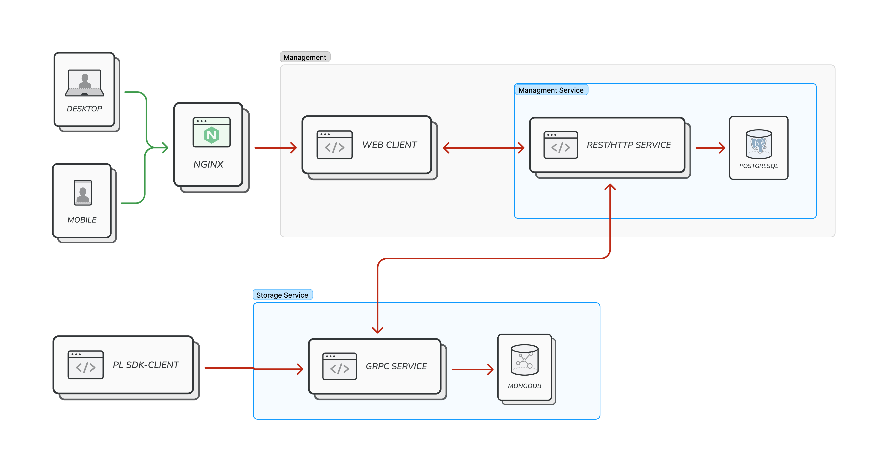
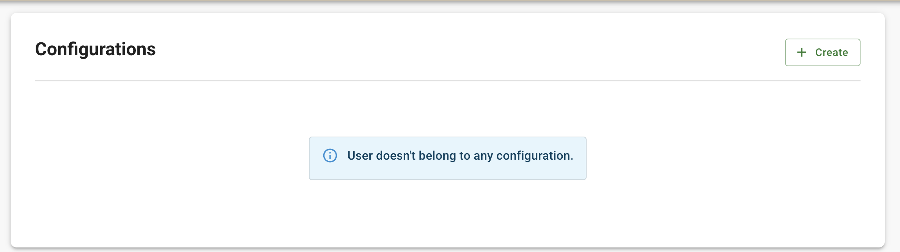
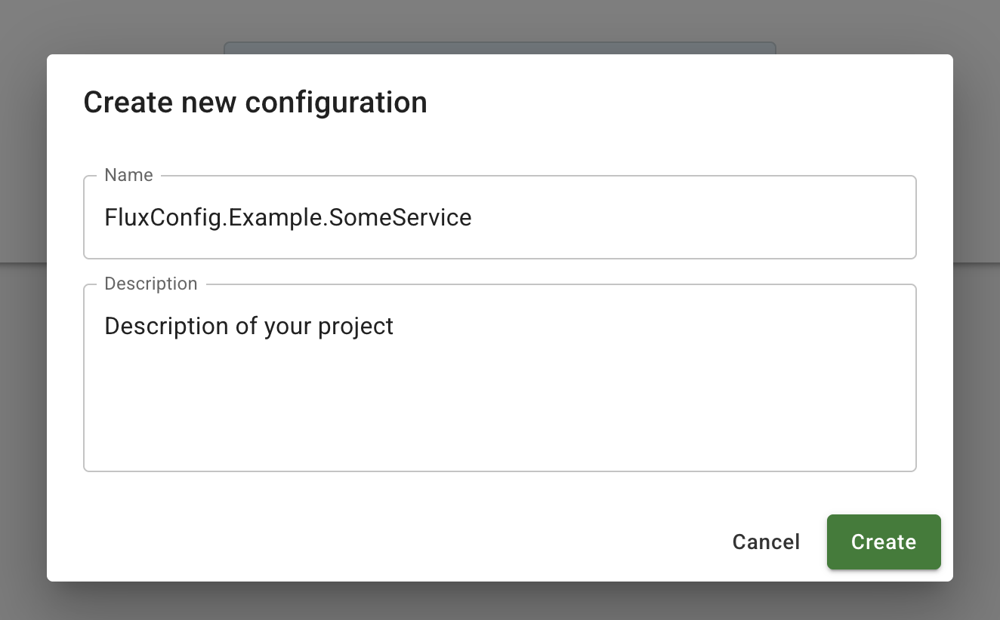
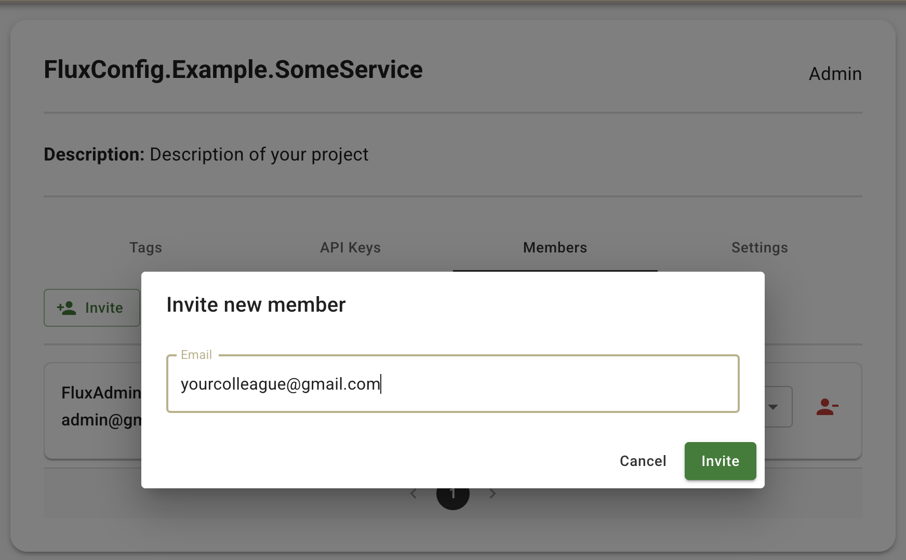
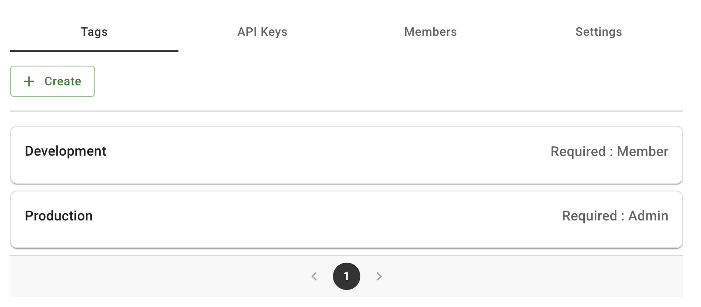
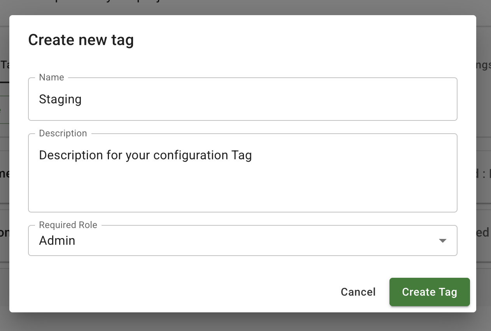
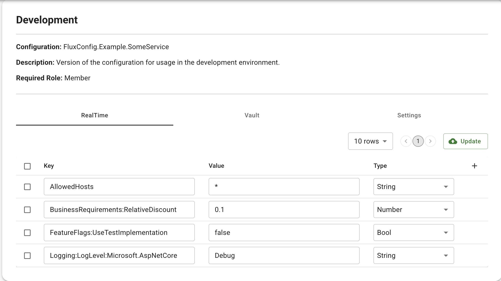
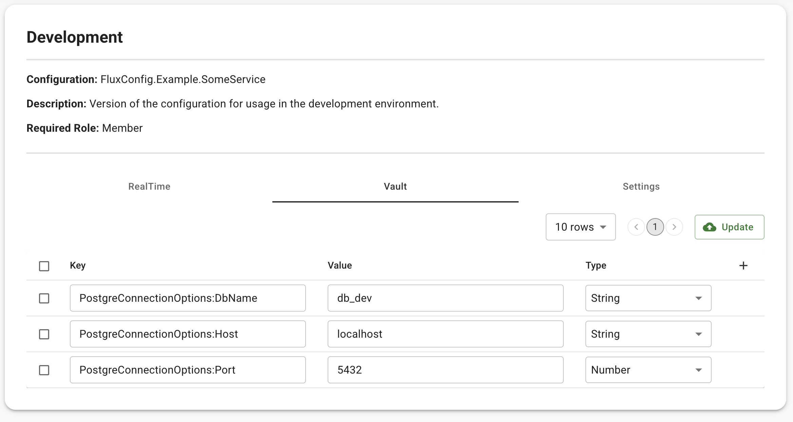
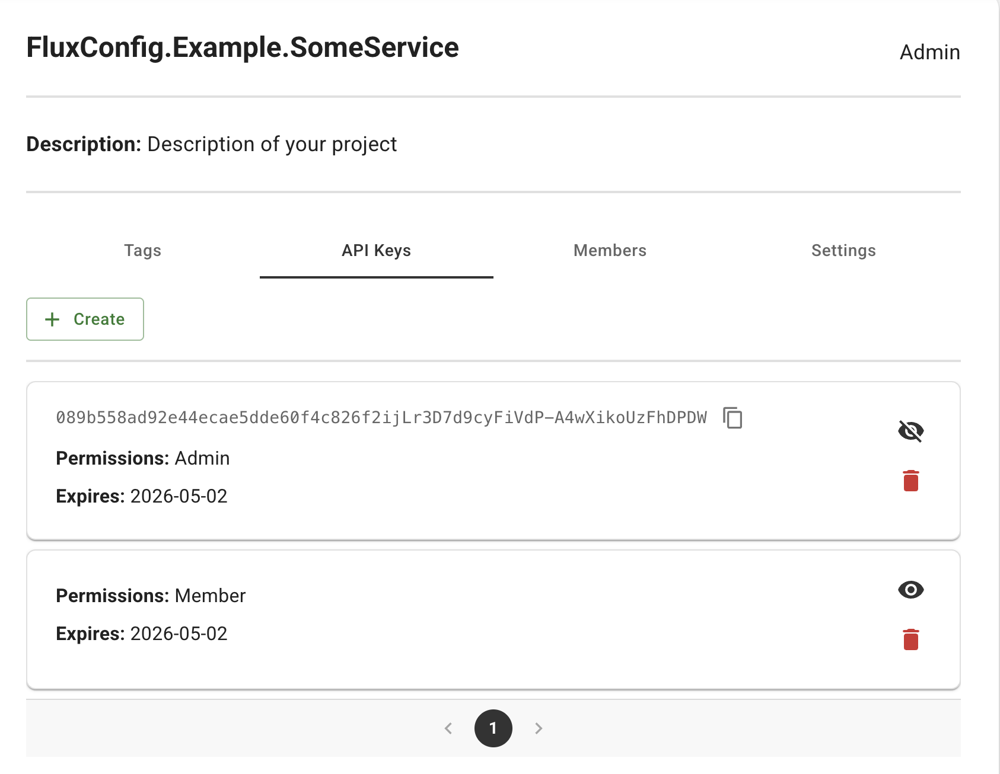

# FluxConfig - Remote Configuration Storage System

FluxConfig is self-hosted configuration storage and management service aimed at optimizing the process of application maintenance and development.

Provides isolated storage for application configuration data by versions - tags, configuration data management, feature flag support, system user management, permissions separation in the system and within the configuration by roles via a web client, automated retrieval and update of configuration of the already deployed application without the need to restart the application or interact with the deployment environment via provided SDK clients for various programming languages ​​and frameworks.

## How does it work

- You install the system in your own controlled environment

- Manage the configuration parameters and feature flags of the application using the web client.

  - Each application configuration can have multiple version-tags with corresponding requirements for the configuration participant role. 
  - Each version-tag of the configuration  is divided into 2 parts - RealTime section, which allows automatic data modification during application runtime and is intended for use of feature flags and dynamic data and Vault section, the data of which is loaded by the application once at startup and cannot be modified during application runtime, intended for storing sensitive data and infrastructure parameters of the application environment.

- Using the system-provided SDK clients, the application receives up-to-date data and updates the application configuration parameters in runtime.

  

## Get started with FluxConfig

### 1. Deploy system according to provided [Guidance](https://github.com/FluxConfig/Deployment)

FluxConfig is modular, so you can deploy all its parts on one system or each part separately.

### 2. Manage applications configurations with web-client

#### 2.1 Sign-in into account or create one

#### 2.2 Create or join configuration for your project

**Create if allowed**

  

  

**Invite members**

  

#### 2.3 Create configuration Tag if needed and allowed for your role

  

  

#### 2.4 Create or update configuration data for Tag allowed for your role

  

  

#### 2.5 Get an API-key for configuration Tag allowed for your role

  

### 3. Use provided SDK-clients in your application to retrieve configuration data.

## List of avaliable open-source SDK-clients

| **SDK-client** | Package | Repository |
| -------- | -------- | -------- |
| .NET  |  [NuGet](https://www.nuget.org/packages/FluxConfig.Provider)   |  [FluxConfig.Provider](https://github.com/FluxConfig/FluxConfig.Provider)  |